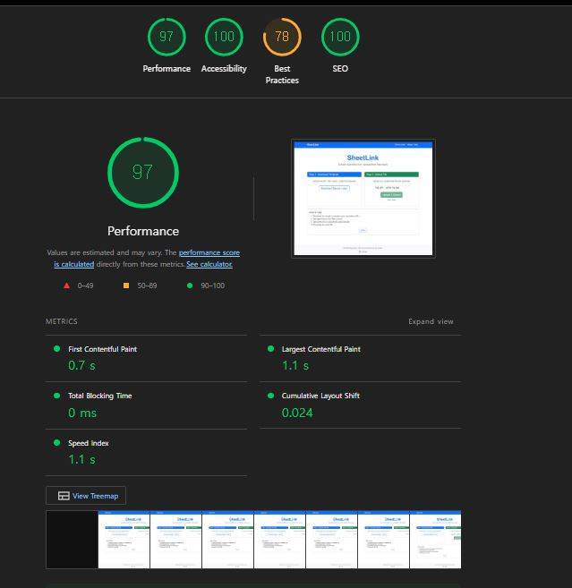

<div align="center">


# SheetLink

Free online tool to extract hyperlinks from spreadsheet files and merge Title + URL into clickable links.

🔗 **Live Site**: [sheetlink.hyunjo.uk](https://sheetlink.hyunjo.uk)


</div>

## Features

- **Excel Link Extraction**: Extract hyperlinks from Excel/spreadsheet cells and export URLs
- **Excel Link Merging**: Combine separate Title and URL columns into clickable hyperlinks in Excel
- **Excel Format Support**: Works with Microsoft Excel files (.xlsx, .xls)
- **No Server Storage**: All processing happens in-memory (privacy-focused)
- **Free & Open Source**: No registration required

## Tech Stack

- **Backend**: ASP.NET Core 10.0 (Blazor Server)
- **Excel Processing**: DocumentFormat.OpenXml (Microsoft official)
- **Deployment**: Cloudflare Tunnel
- **Hosting**: Self-hosted on Ubuntu 24.04

## Quick Start

### Running Locally

```bash
dotnet run --project ExcelLinkExtractorWeb
```

Visit `http://localhost:5050`

### Building

```bash
dotnet build
```

### Publishing

```bash
dotnet publish ExcelLinkExtractorWeb -c Release -o ./publish
```

### Health Check

The app exposes a basic health endpoint at `/health` (memory/disk check) for probes/load balancers.

### Metrics

Basic in-memory metrics are available at `/metrics` (counts, rows, bytes, errors) for local/ops inspection.

### Caching

Static assets are cacheable (1 week). Response caching is enabled for GET requests where applicable.

### Docker

**Quick Start (from Docker Hub):**
```bash
docker run -d -p 5050:5050 hyunjojung/sheetlink:latest
```

**Using docker-compose:**
```bash
docker compose up -d
# App listens on http://localhost:5050
```

See [Docker Deployment Guide](docs/DOCKER_DEPLOYMENT.md) for production deployment.

## Development & Tests

```bash
# Build
dotnet build

# Unit tests (xUnit)
dotnet test ExcelLinkExtractor.Tests/ExcelLinkExtractor.Tests.csproj

# E2E tests (NUnit + Playwright; auto-starts local server on a free port)
DOTNET_ROOT=/home/dev/.dotnet dotnet test ExcelLinkExtractorWeb.E2ETests/ExcelLinkExtractorWeb.E2ETests.csproj

# Coverage (writes cobertura to TestResults/coverage)
dotnet test ExcelLinkExtractor.Tests/ExcelLinkExtractor.Tests.csproj /p:CollectCoverage=true /p:CoverletOutputFormat=cobertura /p:CoverletOutput=TestResults/coverage/
```

## Project Structure

```
ExcelLinkExtractor/
├── ExcelLinkExtractorWeb/          # Main web application
│   ├── Components/
│   │   ├── Pages/                  # Blazor pages (Home, Merge, FAQ)
│   │   └── Layout/                 # Layout components
│   ├── Services/                   # Business logic
│   │   └── LinkExtractorService.cs # Excel processing
│   └── wwwroot/                    # Static files
└── LICENSE                         # Apache License 2.0
```

## Documentation

- Architecture: [docs/ARCHITECTURE.md](docs/ARCHITECTURE.md)
- Configuration: [docs/CONFIGURATION.md](docs/CONFIGURATION.md)
- Security: [docs/SECURITY.md](docs/SECURITY.md)
- Troubleshooting: [docs/TROUBLESHOOTING.md](docs/TROUBLESHOOTING.md)
- Contributing: [docs/CONTRIBUTING.md](docs/CONTRIBUTING.md)
- Index: [docs/README.md](docs/README.md)

## Key Features

### URL Sanitization

All URLs are validated and sanitized:
- Automatically adds `https://` if missing
- Validates URL format with `Uri.TryCreate`
- Restricts to `http`, `https`, `mailto` schemes only
- 2000 character limit (Excel hyperlink limitation)

### Excel Processing

- Searches first 10 rows for header columns
- Supports `.xlsx` and `.xls` formats
- 10MB file size limit
- Preserves cell styling where possible

## Performance



## Contributing

Suggestions and bug reports are welcome via GitHub issues.

## Disclaimer

**SheetLink is an independent, open-source project and is not affiliated with, endorsed by, or sponsored by Microsoft Corporation.**

"Excel" and "Microsoft Excel" are trademarks of Microsoft Corporation. This tool provides functionality to work with Excel file formats (.xlsx, .xls) but is developed and maintained independently. All Excel-related file processing is performed using open-source libraries (DocumentFormat.OpenXml).

## License

Apache License 2.0 - see [LICENSE](LICENSE) for details.

## Author

Created by [HyunjoJung](https://github.com/HyunjoJung)
